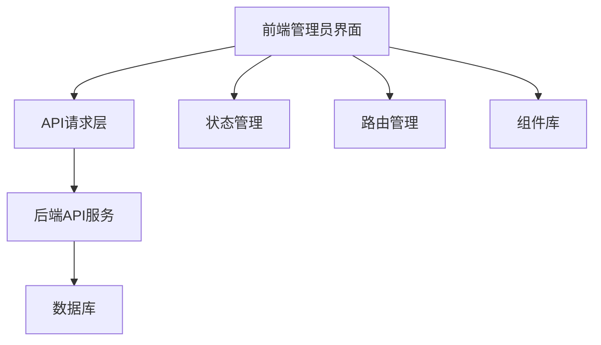

# 益禾堂奶茶点餐系统 - 前端管理员界面设计文档

## 1. 项目概述

本文档旨在设计和实现益禾堂奶茶点餐系统的前端管理员界面，为后台管理人员提供一个直观、高效的管理工具。管理员界面将实现商品管理、分类管理、订单管理、用户管理、优惠券管理、促销活动管理等核心功能。

### 1.1 系统目标

- 提供完整的后台管理功能
- 实现响应式设计，适配不同设备
- 确保界面美观、易用
- 保证系统稳定、高效运行
- 支持数据的增删改查操作

### 1.2 设计原则

- **用户体验优先**：界面简洁明了，操作流程清晰
- **功能完整**：覆盖所有管理需求
- **性能优化**：减少加载时间，提高响应速度
- **可扩展性**：便于后续功能扩展和维护

## 2. 技术栈选择

### 2.1 前端框架

- **Vue 3**：采用最新的组合式API，提供更好的类型推断和性能
- **Vite**：作为构建工具，提供更快的开发体验
- **TypeScript**：增强代码可维护性和类型安全

### 2.2 UI组件库

- **Element Plus**：提供丰富的UI组件，支持响应式设计
- **Tailwind CSS**：用于快速构建自定义界面

### 2.3 状态管理

- **Pinia**：Vue 3官方推荐的状态管理库，替代Vuex

### 2.4 网络请求

- **Axios**：用于处理API请求，支持拦截器和请求/响应转换

### 2.5 工具库

- **Lodash**：提供实用的工具函数
- **Day.js**：处理日期时间
- **Vue Router**：路由管理

## 3. 系统架构

### 3.1 整体架构


```mermaid
flowchart TD
    A[前端管理员界面] --> B[API请求层]
    B --> C[后端API服务]
    C --> D[数据库]
    
    A --> E[状态管理]
    A --> F[路由管理]
    A --> G[组件库]
```

### 3.2 目录结构

```
admin-frontend/
├── public/
├── src/
│   ├── assets/          # 静态资源
│   ├── components/      # 公共组件
│   ├── views/           # 页面视图
│   │   ├── dashboard/   # 仪表盘
│   │   ├── product/     # 商品管理
│   │   ├── category/    # 分类管理
│   │   ├── order/       # 订单管理
│   │   ├── user/        # 用户管理
│   │   ├── coupon/      # 优惠券管理
│   │   ├── promotion/   # 促销活动管理
│   │   ├── banner/      # 轮播图管理
│   │   ├── admin/       # 管理员管理
│   │   ├── address/     # 地址管理
│   │   ├── cart/        # 购物车管理
│   │   ├── payment/     # 支付管理
│   │   └── system/      # 系统设置
│   ├── router/          # 路由配置
│   ├── store/           # 状态管理
│   ├── api/             # API请求
│   ├── utils/           # 工具函数
│   ├── types/           # TypeScript类型定义
│   ├── App.vue          # 根组件
│   └── main.ts          # 入口文件
├── .env                 # 环境变量
├── vite.config.ts       # Vite配置
├── tsconfig.json        # TypeScript配置
└── package.json         # 项目依赖
```

## 4. 页面结构和功能

### 4.1 布局结构

- **顶部导航栏**：系统标题、用户信息、退出登录
- **左侧菜单栏**：功能模块导航
- **主内容区**：对应功能模块的操作界面
- **面包屑导航**：显示当前页面路径

### 4.2 核心页面

#### 4.2.1 仪表盘
- 系统概览
- 数据统计（订单、销售、用户等）
- 最近订单
- 系统通知

#### 4.2.2 商品管理
- 商品列表（支持分页、搜索、筛选）
- 商品详情查看
- 商品添加/编辑
- 商品删除
- 商品规格管理

#### 4.2.3 分类管理
- 分类列表
- 分类添加/编辑
- 分类删除
- 分类排序

#### 4.2.4 订单管理
- 订单列表（支持状态筛选、时间范围查询）
- 订单详情查看
- 订单状态更新
- 订单统计

#### 4.2.5 用户管理
- 用户列表
- 用户详情查看
- 用户状态管理
- 用户消费记录

#### 4.2.6 优惠券管理
- 优惠券列表
- 优惠券添加/编辑
- 优惠券删除
- 优惠券使用记录

#### 4.2.7 促销活动管理
- 活动列表
- 活动添加/编辑
- 活动删除
- 活动状态管理

#### 4.2.8 轮播图管理
- 轮播图列表
- 轮播图添加/编辑
- 轮播图删除
- 轮播图排序

#### 4.2.9 管理员管理
- 管理员列表
- 管理员添加/编辑
- 管理员删除
- 管理员状态管理

#### 4.2.10 角色与权限管理
- 角色列表
- 角色添加/编辑
- 角色删除
- 权限分配

#### 4.2.11 系统日志
- 操作日志
- 登录日志
- 日志查询和筛选

## 5. API接口集成

### 5.1 API基础配置

- **基础URL**：`http://localhost:8080/api`
- **请求头**：包含认证信息
- **响应格式**：统一的JSON格式

### 5.2 核心API接口

#### 5.2.1 管理员认证

| 接口 | 方法 | 功能 |
|------|------|------|
| `/api/admin/login` | POST | 管理员登录 |
| `/api/admin/current` | GET | 获取当前管理员信息 |

#### 5.2.2 商品管理

| 接口 | 方法 | 功能 |
|------|------|------|
| `/api/product/admin/list` | GET | 获取商品列表 |
| `/api/product/detail/{id}` | GET | 获取商品详情 |
| `/api/product/admin/add` | POST | 添加商品 |
| `/api/product/admin/update` | POST | 更新商品 |
| `/api/product/admin/delete/{id}` | POST | 删除商品 |
| `/api/product/user/list` | GET | 用户端商品列表 |
| `/api/product/user/search` | GET | 商品搜索 |

#### 5.2.3 分类管理

| 接口 | 方法 | 功能 |
|------|------|------|
| `/api/category/list` | GET | 获取分类列表 |
| `/api/category/save` | POST | 保存分类（添加/更新） |
| `/api/category/delete/{id}` | POST | 删除分类 |

#### 5.2.4 订单管理

| 接口 | 方法 | 功能 |
|------|------|------|
| `/api/order/admin/order/list` | GET | 管理员获取订单列表 |
| `/api/order/detail/{orderId}` | GET | 获取订单详情 |
| `/api/order/admin/order/update` | POST | 更新订单状态 |
| `/api/order/create` | POST | 创建订单 |
| `/api/order/list/{userId}` | GET | 用户订单列表 |
| `/api/order/reorder` | POST | 快速重新下单 |
| `/api/order/validate-take-code` | POST | 验证取餐码 |

#### 5.2.5 用户管理

| 接口 | 方法 | 功能 |
|------|------|------|
| `/api/admin/user/list` | GET | 管理员获取用户列表 |
| `/api/admin/user/detail/{id}` | GET | 获取用户详情 |
| `/api/admin/user/edit` | PUT | 编辑用户信息 |
| `/api/admin/user/status/{id}` | PUT | 更新用户状态 |

#### 5.2.6 优惠券管理

| 接口 | 方法 | 功能 |
|------|------|------|
| `/api/admin/coupon/list` | GET | 获取优惠券列表 |
| `/api/admin/coupon/save` | POST | 保存优惠券（添加/更新） |
| `/api/admin/coupon/delete/{id}` | POST | 删除优惠券 |

#### 5.2.7 轮播图管理

| 接口 | 方法 | 功能 |
|------|------|------|
| `/api/admin/banner/list` | GET | 获取轮播图列表 |
| `/api/admin/banner/save` | POST | 保存轮播图（添加/更新） |
| `/api/admin/banner/delete/{id}` | POST | 删除轮播图 |

#### 5.2.8 管理员管理

| 接口 | 方法 | 功能 |
|------|------|------|
| `/api/admin/list` | GET | 获取管理员列表 |
| `/api/admin/add` | POST | 添加管理员 |
| `/api/admin/edit` | PUT | 编辑管理员 |
| `/api/admin/delete/{id}` | DELETE | 删除管理员 |
| `/api/admin/status/{id}` | PUT | 更新管理员状态 |

#### 5.2.9 角色与权限管理

| 接口 | 方法 | 功能 |
|------|------|------|
| `/api/admin/role/list` | GET | 获取角色列表 |
| `/api/admin/role/add` | POST | 添加角色 |
| `/api/admin/role/edit` | PUT | 编辑角色 |
| `/api/admin/role/delete/{id}` | DELETE | 删除角色 |
| `/api/admin/role/status/{id}` | PUT | 更新角色状态 |
| `/api/admin/permission/list` | GET | 获取权限列表 |
| `/api/admin/permission/add` | POST | 添加权限 |
| `/api/admin/permission/edit` | PUT | 编辑权限 |
| `/api/admin/permission/delete/{id}` | DELETE | 删除权限 |
| `/api/admin/role/permissions/{roleId}` | GET | 获取角色的权限 |
| `/api/admin/role/assign-permissions/{roleId}` | POST | 分配权限给角色 |

#### 5.2.10 系统统计

| 接口 | 方法 | 功能 |
|------|------|------|
| `/api/admin/statistics/overview` | GET | 获取系统概览统计 |
| `/api/admin/statistics/orders` | GET | 获取订单统计 |
| `/api/admin/statistics/sales` | GET | 获取销售统计 |
| `/api/admin/statistics/users` | GET | 获取用户统计 |
| `/api/admin/statistics/product-ranking` | GET | 获取产品销售排名 |

#### 5.2.11 系统日志

| 接口 | 方法 | 功能 |
|------|------|------|
| `/api/admin/logs/operation` | GET | 查询操作日志列表 |
| `/api/admin/logs/login` | GET | 查询登录日志列表 |

## 6. 数据模型

### 6.1 商品模型

```typescript
interface Product {
  id: number;
  categoryId: number;
  name: string;
  enName: string;
  description: string;
  detail: string;
  mainImage: string;
  images: string;
  basePrice: number;
  originPrice: number;
  inventory: number;
  salesCount: number;
  isHot: number;
  isNew: number;
  isRecommend: number;
  customOptions: string;
  status: number;
  sortOrder: number;
  createTime: string;
  updateTime: string;
}
```

### 6.2 订单模型

```typescript
interface Order {
  id: number;
  orderNo: string;
  userId: number;
  totalAmount: number;
  discountAmount: number;
  deliveryFee: number;
  actualAmount: number;
  paymentMethod: number;
  paymentStatus: number;
  paymentTime: string;
  transactionId: string;
  orderStatus: number;
  orderType: number;
  takeCode: string;
  estimatedTime: string;
  completeTime: string;
  cancelReason: string;
  cancelTime: string;
  userRemark: string;
  adminRemark: string;
  createTime: string;
  updateTime: string;
  addressId: number;
  couponId: number;
}
```

### 6.3 用户模型

```typescript
interface User {
  id: number;
  username: string;
  password: string;
  nickname: string;
  avatar: string;
  phone: string;
  email: string;
  gender: number;
  birthday: string;
  status: number;
  createTime: string;
  updateTime: string;
}
```

### 6.4 管理员模型

```typescript
interface Admin {
  id: number;
  username: string;
  password: string;
  nickname: string;
  avatar: string;
  phone: string;
  email: string;
  roleId: number;
  status: number;
  createTime: string;
  updateTime: string;
}
```

### 6.5 优惠券模型

```typescript
interface Coupon {
  id: number;
  name: string;
  type: number;
  value: number;
  minAmount: number;
  totalCount: number;
  remainingCount: number;
  limitPerUser: number;
  validityType: number;
  startTime: string;
  endTime: string;
  validDays: number;
  applicableProducts: string;
  applicableCategories: string;
  status: number;
  createTime: string;
}
```

### 6.6 地址模型

```typescript
interface Address {
  id: number;
  userId: number;
  consignee: string;
  phone: string;
  province: string;
  city: string;
  district: string;
  detailAddress: string;
  postalCode: string;
  longitude: number;
  latitude: number;
  isDefault: number;
  status: number;
  createTime: string;
  updateTime: string;
}
```

## 7. 功能模块详细设计

### 7.1 商品管理模块

#### 7.1.1 商品列表
- 支持按名称、分类、状态搜索
- 支持价格范围筛选
- 支持排序（销量、价格、创建时间）
- 每页显示10/20/50条记录
- 批量操作（批量删除）

#### 7.1.2 商品添加/编辑
- 基本信息填写（名称、分类、价格等）
- 商品图片上传
- 商品规格配置（甜度、温度、杯型、加料等）
- 商品详情富文本编辑
- 状态设置（上架/下架）

### 7.2 分类管理模块

#### 7.2.1 分类列表
- 显示分类名称、图标、排序
- 支持启用/禁用状态切换
- 支持拖拽排序

#### 7.2.2 分类添加/编辑
- 分类名称
- 分类图标选择
- 分类描述
- 排序设置

### 7.3 订单管理模块

#### 7.3.1 订单列表
- 支持按订单号、用户ID搜索
- 支持按订单状态、支付状态筛选
- 支持按时间范围查询
- 显示订单基本信息（订单号、用户、金额、状态）

#### 7.3.2 订单详情
- 订单基本信息
- 商品列表
- 支付信息
- 配送信息
- 操作日志

### 7.4 用户管理模块

#### 7.4.1 用户列表
- 支持按用户名、手机号搜索
- 支持按状态筛选
- 显示用户基本信息

#### 7.4.2 用户详情
- 详细的用户信息
- 历史订单记录
- 优惠券使用记录
- 积分记录

### 7.5 优惠券管理模块

#### 7.5.1 优惠券列表
- 显示优惠券名称、类型、价值、状态
- 支持按类型、状态筛选
- 显示剩余数量

#### 7.5.2 优惠券添加/编辑
- 优惠券名称
- 优惠券类型（满减券、折扣券）
- 优惠金额/折扣比例
- 使用条件（最低消费）
- 有效期设置
- 发放数量设置

### 7.6 管理员管理模块

#### 7.6.1 管理员列表
- 显示管理员用户名、昵称、角色
- 支持按状态筛选
- 支持编辑和删除操作

#### 7.6.2 管理员添加/编辑
- 基本信息填写
- 角色分配
- 状态设置

### 7.7 角色与权限管理模块

#### 7.7.1 角色管理
- 角色列表显示
- 角色添加/编辑
- 角色权限分配

#### 7.7.2 权限管理
- 权限列表显示
- 权限添加/编辑
- 权限分类管理

### 7.8 系统统计模块

#### 7.8.1 概览统计
- 总订单数
- 总销售额
- 总用户数
- 今日订单数和销售额

#### 7.8.2 订单统计
- 订单状态分布
- 订单趋势图
- 订单来源分析

#### 7.8.3 销售统计
- 销售额趋势
- 商品销售排名
- 分类销售占比

#### 7.8.4 用户统计
- 用户增长趋势
- 用户活跃度
- 用户消费分析

### 7.9 系统日志模块

#### 7.9.1 操作日志
- 操作人、操作时间、操作内容
- 支持按模块、管理员、时间范围筛选
- 详细的操作记录

#### 7.9.2 登录日志
- 登录用户、登录时间、登录IP
- 登录状态（成功/失败）
- 支持按用户名、IP、时间范围筛选

## 8. 实现建议

### 8.1 开发流程

1. **环境搭建**：初始化Vue 3 + TypeScript项目，配置依赖
2. **基础架构**：搭建路由、状态管理、API请求层
3. **布局实现**：实现整体布局和导航
4. **模块开发**：按功能模块依次开发
5. **API集成**：集成后端API接口
6. **测试优化**：功能测试和性能优化
7. **部署上线**：构建生产版本并部署

### 8.2 技术要点

- **响应式设计**：使用Element Plus的响应式组件和Tailwind CSS
- **表单验证**：使用Vue的表单验证或Element Plus的表单验证
- **文件上传**：实现图片上传功能，支持多图上传和预览
- **数据可视化**：使用ECharts实现数据统计图表
- **权限管理**：实现基于角色的权限控制
- **国际化**：支持中英文切换

### 8.3 性能优化

- **路由懒加载**：减少初始加载时间
- **组件懒加载**：按需加载组件
- **图片优化**：使用适当尺寸的图片，支持懒加载
- **缓存策略**：合理使用缓存，减少重复请求
- **代码分割**：按功能模块分割代码

### 8.4 安全性

- **XSS防护**：对用户输入进行过滤和转义
- **CSRF防护**：使用CSRF token
- **API认证**：实现JWT认证
- **敏感信息保护**：不存储敏感信息在前端

## 9. 项目启动和部署

### 9.1 开发环境

```bash
# 安装依赖
npm install

# 启动开发服务器
npm run dev
```

### 9.2 生产构建

```bash
# 构建生产版本
npm run build

# 预览生产构建
npm run preview
```

### 9.3 部署建议

- **静态文件部署**：将构建后的文件部署到Nginx或Apache
- **容器化部署**：使用Docker容器部署
- **CDN加速**：使用CDN加速静态资源
- **HTTPS配置**：配置HTTPS，提高安全性

## 10. 总结

本设计文档详细规划了益禾堂奶茶点餐系统的前端管理员界面，包括技术栈选择、系统架构、页面结构、API集成、数据模型和功能模块设计。通过本设计，可以构建一个功能完整、界面美观、性能优良的后台管理系统，为管理人员提供便捷的管理工具。

在实现过程中，应遵循前端开发最佳实践，注重用户体验和代码质量，确保系统的稳定性和可扩展性。同时，应与后端开发人员密切配合，确保API接口的正确集成和数据交互的顺畅。