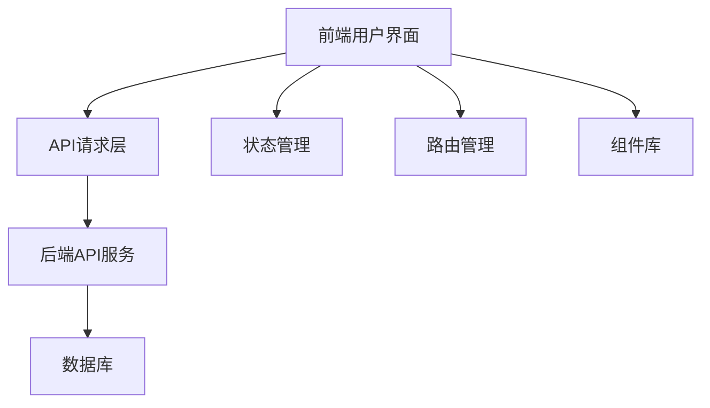

# 益禾堂奶茶点餐系统 - 用户端开发文档

## 1. 系统概述

益禾堂奶茶点餐系统是一个完整的餐饮管理系统，包含前台用户点餐和后台管理功能。本文档将详细说明如何使用AI创建一个功能完整的用户端，基于现有的后端API接口。

### 1.1 系统功能

- **用户登录**：微信小程序登录、测试账号登录
- **商品浏览**：商品列表、商品详情、商品搜索
- **购物车管理**：添加商品、修改数量、删除商品
- **订单管理**：创建订单、订单列表、订单详情、重新下单
- **地址管理**：添加地址、编辑地址、删除地址、设置默认地址
- **优惠券管理**：领取优惠券、查看优惠券、使用优惠券
- **取餐码验证**：验证取餐码
- **个人中心**：用户信息、订单历史、收藏管理

## 2. 技术栈选择

### 2.1 前端技术

- **框架**：Vue 3 + TypeScript
- **构建工具**：Vite
- **UI组件库**：Element Plus
- **状态管理**：Pinia
- **路由**：Vue Router
- **网络请求**：Axios
- **CSS预处理器**：Tailwind CSS

### 2.2 后端技术

- **框架**：Spring Boot 2.7.18
- **语言**：Java 11
- **数据库**：MySQL 8.0
- **ORM**：MyBatis + MyBatis-Plus
- **认证**：JWT
- **安全**：Spring Security

## 3. 系统架构

### 3.1 整体架构



### 3.2 目录结构

```
user-frontend/
├── public/
├── src/
│   ├── assets/          # 静态资源
│   ├── components/      # 公共组件
│   ├── views/           # 页面视图
│   │   ├── login/       # 登录页面
│   │   ├── home/        # 首页
│   │   ├── product/     # 商品详情
│   │   ├── cart/        # 购物车
│   │   ├── order/       # 订单相关
│   │   ├── address/     # 地址管理
│   │   ├── coupon/      # 优惠券管理
│   │   └── profile/     # 个人中心
│   ├── router/          # 路由配置
│   ├── store/           # 状态管理
│   ├── api/             # API请求
│   ├── utils/           # 工具函数
│   ├── types/           # TypeScript类型定义
│   ├── App.vue          # 根组件
│   └── main.ts          # 入口文件
├── .env                 # 环境变量
├── vite.config.ts       # Vite配置
├── tsconfig.json        # TypeScript配置
└── package.json         # 项目依赖
```

## 4. 核心功能模块

### 4.1 登录模块

- **功能**：微信小程序登录、测试账号登录、token管理
- **API**：
  - `POST /api/user/login` - 微信小程序登录
  - `POST /api/user/test/login` - 测试账号登录
  - `GET /api/user/checkToken` - 检查token有效性
- **实现**：
  - 登录表单
  - 微信授权登录
  - token存储和管理
  - 路由守卫实现权限控制

### 4.2 首页模块

- **功能**：轮播图、商品分类、热门商品、推荐商品
- **API**：
  - `GET /api/banner/list` - 获取轮播图
  - `GET /api/category/list` - 获取分类列表
  - `GET /api/product/user/list` - 获取商品列表
- **实现**：
  - 轮播图组件
  - 分类导航
  - 商品列表展示
  - 搜索框

### 4.3 商品详情模块

- **功能**：商品信息、商品规格、添加到购物车
- **API**：
  - `GET /api/product/detail/{id}` - 获取商品详情
- **实现**：
  - 商品图片展示
  - 商品信息详情
  - 规格选择器
  - 数量选择器
  - 添加到购物车按钮

### 4.4 购物车模块

- **功能**：商品列表、修改数量、删除商品、结算
- **API**：
  - `POST /api/cart/add` - 添加商品到购物车
  - `GET /api/cart/list/{userId}` - 获取购物车列表
  - `PUT /api/cart/update` - 更新购物车商品
  - `DELETE /api/cart/delete` - 删除购物车商品
- **实现**：
  - 购物车商品列表
  - 数量调整
  - 商品删除
  - 全选功能
  - 结算按钮

### 4.5 订单模块

- **功能**：创建订单、订单列表、订单详情、重新下单
- **API**：
  - `POST /api/order/create` - 创建订单
  - `GET /api/order/list/{userId}` - 获取订单列表
  - `GET /api/order/detail/{orderId}` - 获取订单详情
  - `POST /api/order/reorder` - 重新下单
  - `POST /api/order/validate-take-code` - 验证取餐码
- **实现**：
  - 订单创建表单
  - 订单列表展示
  - 订单详情页面
  - 订单状态展示
  - 重新下单功能

### 4.6 地址管理模块

- **功能**：地址列表、添加地址、编辑地址、删除地址、设置默认地址
- **API**：
  - `GET /api/address/list/{userId}` - 获取地址列表
  - `POST /api/address/add` - 添加地址
  - `PUT /api/address/update` - 更新地址
  - `DELETE /api/address/delete/{id}` - 删除地址
  - `PUT /api/address/setDefault/{id}` - 设置默认地址
- **实现**：
  - 地址列表展示
  - 添加地址表单
  - 编辑地址表单
  - 地址删除功能
  - 默认地址设置

### 4.7 优惠券模块

- **功能**：优惠券列表、领取优惠券、使用优惠券
- **API**：
  - `GET /api/coupon/list` - 获取优惠券列表
  - `POST /api/coupon/receive` - 领取优惠券
  - `GET /api/user/coupons` - 获取用户优惠券
- **实现**：
  - 可领取优惠券列表
  - 已拥有优惠券列表
  - 优惠券领取功能
  - 优惠券使用逻辑

### 4.8 个人中心模块

- **功能**：用户信息、订单历史、收藏管理、设置
- **API**：
  - `GET /api/user/profile` - 获取用户信息
  - `PUT /api/user/update` - 更新用户信息
  - `GET /api/product/collection/list/{userId}` - 获取收藏列表
  - `POST /api/product/collection/add` - 添加收藏
  - `DELETE /api/product/collection/delete` - 删除收藏
- **实现**：
  - 用户信息展示
  - 订单历史入口
  - 收藏管理入口
  - 设置页面

## 5. API接口详细说明

### 5.1 认证接口

| 接口 | 方法 | 功能 | 请求体 | 响应体 |
|------|------|------|--------|--------|
| `/api/user/login` | POST | 微信小程序登录 | `{"code": "微信登录code"}` | `{"code": 200, "msg": "成功", "data": {"token": "...", "openid": "...", "userInfo": {...}}}` |
| `/api/user/test/login` | POST | 测试账号登录 | `{"username": "test", "password": "123456"}` | `{"code": 200, "msg": "成功", "data": {"token": "...", "openid": "...", "userInfo": {...}}}` |
| `/api/user/checkToken` | GET | 检查token有效性 | N/A | `{"code": 200, "msg": "token 有效", "data": null}` |

### 5.2 商品接口

| 接口 | 方法 | 功能 | 请求体 | 响应体 |
|------|------|------|--------|--------|
| `/api/product/user/list` | GET | 获取商品列表 | N/A | `{"code": 200, "msg": "用户商品查询成功", "data": [...]}` |
| `/api/product/detail/{id}` | GET | 获取商品详情 | N/A | `{"code": 200, "msg": "查询成功", "data": {...}}` |
| `/api/product/user/search` | GET | 搜索商品 | N/A (keyword参数通过查询字符串传递) | `{"code": 200, "msg": "商品搜索成功", "data": [...]}` |

### 5.3 购物车接口

| 接口 | 方法 | 功能 | 请求体 | 响应体 |
|------|------|------|--------|--------|
| `/api/cart/add` | POST | 添加商品到购物车 | `{"userId": 1, "productId": 1, "quantity": 1, "selectedSpecs": "..."}` | `{"code": 200, "msg": "添加成功", "data": null}` |
| `/api/cart/list/{userId}` | GET | 获取购物车列表 | N/A | `{"code": 200, "msg": "查询成功", "data": [...]}` |
| `/api/cart/update` | PUT | 更新购物车商品 | `{"id": 1, "quantity": 2, "isSelected": 1}` | `{"code": 200, "msg": "更新成功", "data": null}` |
| `/api/cart/delete` | DELETE | 删除购物车商品 | `{"ids": [1, 2, 3]}` | `{"code": 200, "msg": "删除成功", "data": null}` |

### 5.4 订单接口

| 接口 | 方法 | 功能 | 请求体 | 响应体 |
|------|------|------|--------|--------|
| `/api/order/create` | POST | 创建订单 | `{"orderType": 1, "paymentMethod": 1, "addressId": 1, "couponId": 1, "userRemark": "..."}` | `{"code": 200, "msg": "操作成功", "data": {...}}` |
| `/api/order/list/{userId}` | GET | 获取订单列表 | N/A | `{"code": 200, "msg": "操作成功", "data": [...]}` |
| `/api/order/detail/{orderId}` | GET | 获取订单详情 | N/A | `{"code": 200, "msg": "操作成功", "data": {...}}` |
| `/api/order/reorder` | POST | 重新下单 | N/A (userId和oldOrderId通过查询字符串传递) | `{"code": 200, "msg": "重新下单成功", "data": {...}}` |
| `/api/order/validate-take-code` | POST | 验证取餐码 | N/A (takeCode通过查询字符串传递) | `{"code": 200, "msg": "取餐码验证成功", "data": {...}}` |

### 5.5 地址接口

| 接口 | 方法 | 功能 | 请求体 | 响应体 |
|------|------|------|--------|--------|
| `/api/address/list/{userId}` | GET | 获取地址列表 | N/A | `{"code": 200, "msg": "查询成功", "data": [...]}` |
| `/api/address/add` | POST | 添加地址 | `{"userId": 1, "consignee": "...", "phone": "...", "province": "...", "city": "...", "district": "...", "detailAddress": "...", "isDefault": 1}` | `{"code": 200, "msg": "添加成功", "data": {...}}` |
| `/api/address/update` | PUT | 更新地址 | `{"id": 1, "consignee": "...", "phone": "...", "province": "...", "city": "...", "district": "...", "detailAddress": "...", "isDefault": 1}` | `{"code": 200, "msg": "更新成功", "data": {...}}` |
| `/api/address/delete/{id}` | DELETE | 删除地址 | N/A | `{"code": 200, "msg": "删除成功", "data": null}` |
| `/api/address/setDefault/{id}` | PUT | 设置默认地址 | N/A | `{"code": 200, "msg": "设置成功", "data": null}` |

### 5.6 优惠券接口

| 接口 | 方法 | 功能 | 请求体 | 响应体 |
|------|------|------|--------|--------|
| `/api/coupon/list` | GET | 获取优惠券列表 | N/A | `{"code": 200, "msg": "查询成功", "data": [...]}` |
| `/api/coupon/receive` | POST | 领取优惠券 | `{"userId": 1, "couponId": 1}` | `{"code": 200, "msg": "领取成功", "data": null}` |
| `/api/user/coupons` | GET | 获取用户优惠券 | N/A (userId通过查询字符串传递) | `{"code": 200, "msg": "查询成功", "data": [...]}` |

### 5.7 个人中心接口

| 接口 | 方法 | 功能 | 请求体 | 响应体 |
|------|------|------|--------|--------|
| `/api/user/profile` | GET | 获取用户信息 | N/A | `{"code": 200, "msg": "查询成功", "data": {...}}` |
| `/api/user/update` | PUT | 更新用户信息 | `{"id": 1, "nickname": "...", "avatarUrl": "...", "phone": "..."}` | `{"code": 200, "msg": "更新成功", "data": {...}}` |
| `/api/product/collection/list/{userId}` | GET | 获取收藏列表 | N/A | `{"code": 200, "msg": "查询成功", "data": [...]}` |
| `/api/product/collection/add` | POST | 添加收藏 | `{"userId": 1, "productId": 1}` | `{"code": 200, "msg": "添加成功", "data": null}` |
| `/api/product/collection/delete` | DELETE | 删除收藏 | `{"userId": 1, "productId": 1}` | `{"code": 200, "msg": "删除成功", "data": null}` |

## 6. 前端实现方案

### 6.1 项目初始化

1. **创建Vue 3 + TypeScript项目**：
   ```bash
   npm create vite@latest user-frontend -- --template vue-ts
   cd user-frontend
   npm install
   ```

2. **安装依赖**：
   ```bash
   npm install element-plus axios pinia vue-router tailwindcss postcss autoprefixer
   ```

3. **配置Tailwind CSS**：
   ```bash
   npx tailwindcss init -p
   ```

### 6.2 基础配置

1. **路由配置** (`src/router/index.ts`)：
   - 配置登录路由
   - 配置各功能模块路由
   - 实现路由守卫

2. **状态管理** (`src/store/index.ts`)：
   - 用户信息状态
   - 购物车状态
   - 订单状态
   - 全局配置状态

3. **API请求封装** (`src/api/index.ts`)：
   - 配置Axios拦截器
   - 统一处理请求和响应
   - 封装API方法

4. **工具函数** (`src/utils/`)：
   - 日期处理
   - 格式化工具
   - 验证工具

### 6.3 页面实现

1. **登录页面**：
   - 微信登录按钮
   - 测试账号登录表单

2. **首页**：
   - 轮播图
   - 分类导航
   - 商品列表
   - 搜索框

3. **商品详情页面**：
   - 商品图片轮播
   - 商品信息
   - 规格选择器
   - 数量选择器
   - 添加到购物车按钮

4. **购物车页面**：
   - 购物车商品列表
   - 数量调整
   - 商品删除
   - 全选功能
   - 结算按钮

5. **订单创建页面**：
   - 地址选择
   - 商品清单
   - 优惠券选择
   - 配送方式选择
   - 支付方式选择
   - 提交订单按钮

6. **订单列表页面**：
   - 订单状态筛选
   - 订单列表展示
   - 订单状态显示
   - 订单详情入口

7. **订单详情页面**：
   - 订单基本信息
   - 商品列表
   - 支付信息
   - 配送信息
   - 操作按钮（重新下单、验证取餐码）

8. **地址管理页面**：
   - 地址列表
   - 添加地址按钮
   - 编辑地址按钮
   - 删除地址按钮
   - 设置默认地址

9. **优惠券页面**：
   - 可领取优惠券列表
   - 已拥有优惠券列表
   - 领取优惠券按钮

10. **个人中心页面**：
    - 用户信息展示
    - 订单历史入口
    - 收藏管理入口
    - 设置入口

### 6.4 功能实现

1. **权限控制**：
   - 基于token的权限控制
   - 路由守卫
   - 未登录状态重定向

2. **表单验证**：
   - 前端表单验证
   - 后端数据校验

3. **购物车逻辑**：
   - 商品添加
   - 数量调整
   - 选中状态管理
   - 结算逻辑

4. **订单逻辑**：
   - 订单创建
   - 订单状态管理
   - 重新下单
   - 取餐码验证

5. **地址管理**：
   - 地址CRUD操作
   - 默认地址设置
   - 地址选择

6. **优惠券逻辑**：
   - 优惠券领取
   - 优惠券使用
   - 优惠券列表展示

## 7. 部署和测试

### 7.1 开发环境

1. **启动后端服务**：
   ```bash
   cd backend
   mvn spring-boot:run
   ```

2. **启动前端开发服务器**：
   ```bash
   cd user-frontend
   npm run dev
   ```

### 7.2 生产环境

1. **构建前端项目**：
   ```bash
   cd user-frontend
   npm run build
   ```

2. **部署前端静态文件**：
   - 将`dist`目录部署到Nginx或Apache
   - 配置反向代理指向后端API

3. **部署后端服务**：
   - 打包成jar文件：`mvn package`
   - 部署到服务器：`java -jar demo.jar`

### 7.3 测试

1. **功能测试**：
   - 登录功能
   - 商品浏览
   - 购物车操作
   - 订单创建
   - 地址管理
   - 优惠券使用

2. **性能测试**：
   - 页面加载速度
   - API响应时间
   - 并发处理能力

3. **兼容性测试**：
   - 不同浏览器
   - 不同设备
   - 不同网络环境

## 8. 技术要点和最佳实践

### 8.1 技术要点

- **响应式设计**：使用Element Plus的响应式组件和Tailwind CSS
- **组件化开发**：将重复功能封装为组件
- **状态管理**：使用Pinia管理全局状态
- **路由守卫**：实现权限控制
- **API封装**：统一处理API请求和响应
- **表单验证**：结合Element Plus的表单验证
- **本地存储**：使用localStorage存储用户信息和购物车数据

### 8.2 最佳实践

- **代码规范**：遵循ESLint和Prettier规范
- **命名规范**：使用语义化的命名
- **注释规范**：添加必要的注释
- **错误处理**：统一处理错误
- **日志记录**：记录关键操作日志
- **性能优化**：
  - 路由懒加载
  - 组件懒加载
  - 图片懒加载
  - 缓存策略
- **安全措施**：
  - XSS防护
  - CSRF防护
  - 敏感信息加密
  - 接口权限验证

## 9. 总结

本文档详细说明了如何使用AI创建一个功能完整的用户端，基于现有的后端API接口。通过遵循本文档的指导，您可以快速构建一个美观、高效、安全的用户端，为益禾堂奶茶点餐系统提供良好的用户体验。

在实现过程中，应注重用户体验和代码质量，确保系统的稳定性和可扩展性。同时，应与后端开发人员密切配合，确保API接口的正确集成和数据交互的顺畅。