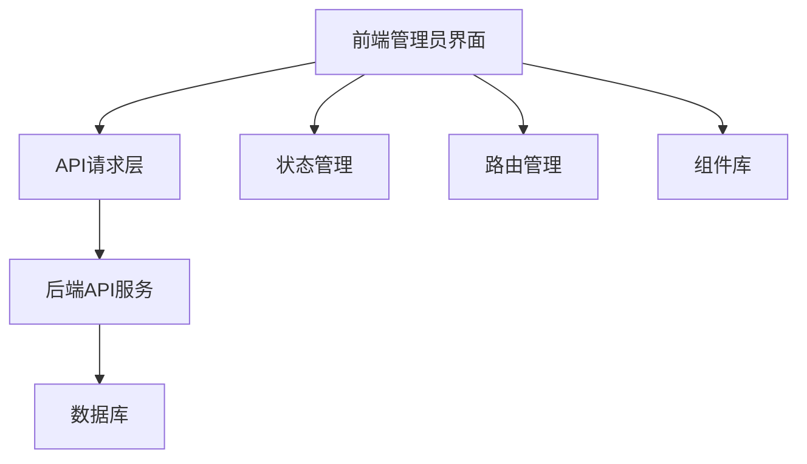

# 益禾堂奶茶点餐系统 - 管理员后台创建文档

## 1. 系统概述

益禾堂奶茶点餐系统是一个完整的餐饮管理系统，包含前台用户点餐和后台管理功能。本文档将详细说明如何使用AI创建一个功能完整的管理员后台，基于现有的后端API接口。

### 1.1 系统功能

- **用户管理**：用户列表、用户详情、用户状态管理
- **商品管理**：商品列表、商品添加/编辑/删除、商品规格管理
- **订单管理**：订单列表、订单详情、订单状态更新
- **管理员管理**：管理员列表、管理员添加/编辑/删除
- **角色与权限管理**：角色管理、权限管理、权限分配
- **系统统计**：订单统计、销售统计、用户统计、产品销售排名
- **系统日志**：操作日志、登录日志

## 2. 技术栈选择

### 2.1 前端技术

- **框架**：Vue 3 + TypeScript
- **构建工具**：Vite
- **UI组件库**：Element Plus
- **状态管理**：Pinia
- **路由**：Vue Router
- **网络请求**：Axios
- **数据可视化**：ECharts
- **CSS预处理器**：Tailwind CSS

### 2.2 后端技术

- **框架**：Spring Boot 2.7.18
- **语言**：Java 11
- **数据库**：MySQL 8.0
- **ORM**：MyBatis + MyBatis-Plus
- **认证**：JWT
- **安全**：Spring Security

## 3. 系统架构

### 3.1 整体架构



### 3.2 目录结构

```
admin-frontend/
├── public/
├── src/
│   ├── assets/          # 静态资源
│   ├── components/      # 公共组件
│   ├── views/           # 页面视图
│   │   ├── dashboard/   # 仪表盘
│   │   ├── product/     # 商品管理
│   │   ├── order/       # 订单管理
│   │   ├── user/        # 用户管理
│   │   ├── admin/       # 管理员管理
│   │   ├── role/        # 角色管理
│   │   ├── permission/  # 权限管理
│   │   ├── statistics/  # 统计分析
│   │   └── log/         # 系统日志
│   ├── router/          # 路由配置
│   ├── store/           # 状态管理
│   ├── api/             # API请求
│   ├── utils/           # 工具函数
│   ├── types/           # TypeScript类型定义
│   ├── App.vue          # 根组件
│   └── main.ts          # 入口文件
├── .env                 # 环境变量
├── vite.config.ts       # Vite配置
├── tsconfig.json        # TypeScript配置
└── package.json         # 项目依赖
```

## 4. 核心功能模块

### 4.1 登录模块

- **功能**：管理员登录、token管理、权限验证
- **API**：`/api/admin/login`
- **实现**：
  - 登录表单验证
  - JWT token存储和管理
  - 路由守卫实现权限控制

### 4.2 仪表盘模块

- **功能**：系统概览、数据统计、最近订单
- **API**：`/api/admin/statistics/overview`
- **实现**：
  - 数据卡片展示
  - 图表可视化
  - 实时数据更新

### 4.3 商品管理模块

- **功能**：商品列表、商品添加/编辑/删除、商品规格管理
- **API**：
  - `GET /api/product/admin/list` - 获取商品列表
  - `POST /api/product/admin/add` - 添加商品
  - `POST /api/product/admin/update` - 更新商品
  - `POST /api/product/admin/delete/{id}` - 删除商品
- **实现**：
  - 商品列表表格（支持分页、搜索、筛选）
  - 商品详情表单（支持图片上传、规格配置）
  - 批量操作功能

### 4.4 订单管理模块

- **功能**：订单列表、订单详情、订单状态更新
- **API**：
  - `GET /api/order/admin/order/list` - 获取订单列表
  - `GET /api/order/detail/{orderId}` - 获取订单详情
  - `POST /api/order/admin/order/update` - 更新订单状态
- **实现**：
  - 订单列表表格（支持状态筛选、时间范围查询）
  - 订单详情页面（包含商品信息、支付信息、配送信息）
  - 订单状态更新功能

### 4.5 用户管理模块

- **功能**：用户列表、用户详情、用户状态管理
- **API**：
  - `GET /api/admin/user/list` - 获取用户列表
  - `GET /api/admin/user/detail/{id}` - 获取用户详情
  - `PUT /api/admin/user/edit` - 编辑用户信息
  - `PUT /api/admin/user/status/{id}` - 更新用户状态
- **实现**：
  - 用户列表表格（支持搜索、状态筛选）
  - 用户详情页面
  - 用户状态切换功能

### 4.6 管理员管理模块

- **功能**：管理员列表、管理员添加/编辑/删除
- **API**：
  - `GET /api/admin/list` - 获取管理员列表
  - `POST /api/admin/add` - 添加管理员
  - `PUT /api/admin/edit` - 编辑管理员
  - `DELETE /api/admin/delete/{id}` - 删除管理员
  - `PUT /api/admin/status/{id}` - 更新管理员状态
- **实现**：
  - 管理员列表表格
  - 管理员信息表单
  - 密码重置功能

### 4.7 角色与权限管理模块

- **功能**：角色管理、权限管理、权限分配
- **API**：
  - `GET /api/admin/role/list` - 获取角色列表
  - `POST /api/admin/role/add` - 添加角色
  - `PUT /api/admin/role/edit` - 编辑角色
  - `DELETE /api/admin/role/delete/{id}` - 删除角色
  - `GET /api/admin/permission/list` - 获取权限列表
  - `POST /api/admin/permission/add` - 添加权限
  - `PUT /api/admin/permission/edit` - 编辑权限
  - `DELETE /api/admin/permission/delete/{id}` - 删除权限
  - `GET /api/admin/role/permissions/{roleId}` - 获取角色权限
  - `POST /api/admin/role/assign-permissions/{roleId}` - 分配权限
- **实现**：
  - 角色列表和权限列表
  - 权限树状结构展示
  - 权限分配界面

### 4.8 系统统计模块

- **功能**：订单统计、销售统计、用户统计、产品销售排名
- **API**：
  - `GET /api/admin/statistics/orders` - 订单统计
  - `GET /api/admin/statistics/sales` - 销售统计
  - `GET /api/admin/statistics/users` - 用户统计
  - `GET /api/admin/statistics/product-ranking` - 产品销售排名
- **实现**：
  - 统计图表（折线图、柱状图、饼图）
  - 时间范围选择
  - 数据导出功能

### 4.9 系统日志模块

- **功能**：操作日志、登录日志
- **API**：
  - `GET /api/admin/logs/operation` - 操作日志
  - `GET /api/admin/logs/login` - 登录日志
- **实现**：
  - 日志列表表格
  - 日志详情查看
  - 日志搜索和筛选

## 5. API接口详细说明

### 5.1 认证接口

| 接口 | 方法 | 功能 | 请求体 | 响应体 |
|------|------|------|--------|--------|
| `/api/admin/login` | POST | 管理员登录 | `{"username": "admin123", "password": "admin123"}` | `{"code": 200, "msg": "操作成功", "data": {"token": "...", "admin": {...}}}` |
| `/api/admin/current` | GET | 获取当前管理员信息 | N/A | `{"code": 200, "msg": "操作成功", "data": {...}}` |

### 5.2 商品管理接口

| 接口 | 方法 | 功能 | 请求体 | 响应体 |
|------|------|------|--------|--------|
| `/api/product/admin/list` | GET | 获取商品列表 | N/A | `{"code": 200, "msg": "商品查询成功", "data": [...]}` |
| `/api/product/detail/{id}` | GET | 获取商品详情 | N/A | `{"code": 200, "msg": "查询成功", "data": {...}}` |
| `/api/product/admin/add` | POST | 添加商品 | `{"name": "...", "categoryId": 1, "basePrice": 10.0, ...}` | `{"code": 200, "msg": "商品添加成功", "data": null}` |
| `/api/product/admin/update` | POST | 更新商品 | `{"id": 1, "name": "...", "categoryId": 1, ...}` | `{"code": 200, "msg": "商品修改成功", "data": {...}}` |
| `/api/product/admin/delete/{id}` | POST | 删除商品 | N/A | `{"code": 200, "msg": "商品删除成功", "data": null}` |

### 5.3 订单管理接口

| 接口 | 方法 | 功能 | 请求体 | 响应体 |
|------|------|------|--------|--------|
| `/api/order/admin/order/list` | GET | 获取订单列表 | N/A | `{"code": 200, "msg": "操作成功", "data": {"records": [...], "total": 100, ...}}` |
| `/api/order/detail/{orderId}` | GET | 获取订单详情 | N/A | `{"code": 200, "msg": "操作成功", "data": {...}}` |
| `/api/order/admin/order/update` | POST | 更新订单状态 | `{"orderId": 1, "status": 2, "adminRemark": "..."}` | `{"code": 200, "msg": "更新成功", "data": null}` |

### 5.4 用户管理接口

| 接口 | 方法 | 功能 | 请求体 | 响应体 |
|------|------|------|--------|--------|
| `/api/admin/user/list` | GET | 获取用户列表 | N/A | `{"code": 200, "msg": "操作成功", "data": [...]}` |
| `/api/admin/user/detail/{id}` | GET | 获取用户详情 | N/A | `{"code": 200, "msg": "操作成功", "data": {...}}` |
| `/api/admin/user/edit` | PUT | 编辑用户信息 | `{"id": 1, "nickname": "...", "phone": "...", ...}` | `{"code": 200, "msg": "操作成功", "data": {...}}` |
| `/api/admin/user/status/{id}` | PUT | 更新用户状态 | N/A (status参数通过查询字符串传递) | `{"code": 200, "msg": "状态更新成功", "data": null}` |

### 5.5 管理员管理接口

| 接口 | 方法 | 功能 | 请求体 | 响应体 |
|------|------|------|--------|--------|
| `/api/admin/list` | GET | 获取管理员列表 | N/A | `{"code": 200, "msg": "操作成功", "data": [...]}` |
| `/api/admin/add` | POST | 添加管理员 | `{"username": "...", "password": "...", "nickname": "...", ...}` | `{"code": 200, "msg": "操作成功", "data": {...}}` |
| `/api/admin/edit` | PUT | 编辑管理员 | `{"id": 1, "username": "...", "nickname": "...", ...}` | `{"code": 200, "msg": "操作成功", "data": {...}}` |
| `/api/admin/delete/{id}` | DELETE | 删除管理员 | N/A | `{"code": 200, "msg": "删除成功", "data": null}` |
| `/api/admin/status/{id}` | PUT | 更新管理员状态 | N/A (status参数通过查询字符串传递) | `{"code": 200, "msg": "状态更新成功", "data": null}` |

### 5.6 角色与权限管理接口

| 接口 | 方法 | 功能 | 请求体 | 响应体 |
|------|------|------|--------|--------|
| `/api/admin/role/list` | GET | 获取角色列表 | N/A | `{"code": 200, "msg": "操作成功", "data": [...]}` |
| `/api/admin/role/add` | POST | 添加角色 | `{"name": "...", "description": "...", ...}` | `{"code": 200, "msg": "操作成功", "data": {...}}` |
| `/api/admin/role/edit` | PUT | 编辑角色 | `{"id": 1, "name": "...", "description": "...", ...}` | `{"code": 200, "msg": "操作成功", "data": {...}}` |
| `/api/admin/role/delete/{id}` | DELETE | 删除角色 | N/A | `{"code": 200, "msg": "删除成功", "data": null}` |
| `/api/admin/permission/list` | GET | 获取权限列表 | N/A | `{"code": 200, "msg": "操作成功", "data": [...]}` |
| `/api/admin/permission/add` | POST | 添加权限 | `{"name": "...", "code": "...", "url": "...", ...}` | `{"code": 200, "msg": "操作成功", "data": {...}}` |
| `/api/admin/role/permissions/{roleId}` | GET | 获取角色权限 | N/A | `{"code": 200, "msg": "操作成功", "data": [...]}` |
| `/api/admin/role/assign-permissions/{roleId}` | POST | 分配权限 | `{"permissionIds": [1, 2, 3, ...]}` | `{"code": 200, "msg": "权限分配成功", "data": null}` |

### 5.7 系统统计接口

| 接口 | 方法 | 功能 | 请求体 | 响应体 |
|------|------|------|--------|--------|
| `/api/admin/statistics/overview` | GET | 获取系统概览 | N/A | `{"code": 200, "msg": "操作成功", "data": {...}}` |
| `/api/admin/statistics/orders` | GET | 获取订单统计 | N/A (startTime和endTime通过查询字符串传递) | `{"code": 200, "msg": "操作成功", "data": {...}}` |
| `/api/admin/statistics/sales` | GET | 获取销售统计 | N/A (startTime和endTime通过查询字符串传递) | `{"code": 200, "msg": "操作成功", "data": {...}}` |
| `/api/admin/statistics/users` | GET | 获取用户统计 | N/A (startTime和endTime通过查询字符串传递) | `{"code": 200, "msg": "操作成功", "data": {...}}` |
| `/api/admin/statistics/product-ranking` | GET | 获取产品销售排名 | N/A (limit、startTime和endTime通过查询字符串传递) | `{"code": 200, "msg": "操作成功", "data": [...]}` |

### 5.8 系统日志接口

| 接口 | 方法 | 功能 | 请求体 | 响应体 |
|------|------|------|--------|--------|
| `/api/admin/logs/operation` | GET | 查询操作日志 | N/A (pageRequest、module、adminId、startTime、endTime通过查询字符串传递) | `{"code": 200, "msg": "操作成功", "data": {"records": [...], "total": 100, ...}}` |
| `/api/admin/logs/login` | GET | 查询登录日志 | N/A (pageRequest、username、ip、startTime、endTime通过查询字符串传递) | `{"code": 200, "msg": "操作成功", "data": {"records": [...], "total": 100, ...}}` |

## 6. 前端实现方案

### 6.1 项目初始化

1. **创建Vue 3 + TypeScript项目**：
   ```bash
   npm create vite@latest admin-frontend -- --template vue-ts
   cd admin-frontend
   npm install
   ```

2. **安装依赖**：
   ```bash
   npm install element-plus axios pinia vue-router echarts tailwindcss postcss autoprefixer
   ```

3. **配置Tailwind CSS**：
   ```bash
   npx tailwindcss init -p
   ```

### 6.2 基础配置

1. **路由配置** (`src/router/index.ts`)：
   - 配置登录路由
   - 配置各功能模块路由
   - 实现路由守卫

2. **状态管理** (`src/store/index.ts`)：
   - 用户信息状态
   - 权限状态
   - 全局配置状态

3. **API请求封装** (`src/api/index.ts`)：
   - 配置Axios拦截器
   - 统一处理请求和响应
   - 封装API方法

4. **工具函数** (`src/utils/`)：
   - 日期处理
   - 格式化工具
   - 验证工具

### 6.3 页面实现

1. **登录页面**：
   - 登录表单
   - 验证码功能
   - 记住密码

2. **布局组件**：
   - 顶部导航栏
   - 左侧菜单栏
   - 面包屑导航
   - 主内容区

3. **仪表盘页面**：
   - 数据卡片
   - 统计图表
   - 最近订单列表

4. **商品管理页面**：
   - 商品列表表格
   - 商品添加/编辑表单
   - 商品规格配置

5. **订单管理页面**：
   - 订单列表表格
   - 订单详情页面
   - 订单状态更新

6. **用户管理页面**：
   - 用户列表表格
   - 用户详情页面
   - 用户状态管理

7. **管理员管理页面**：
   - 管理员列表表格
   - 管理员添加/编辑表单
   - 密码重置功能

8. **角色与权限管理页面**：
   - 角色列表
   - 权限列表
   - 权限分配界面

9. **系统统计页面**：
   - 订单统计图表
   - 销售统计图表
   - 用户统计图表
   - 产品销售排名

10. **系统日志页面**：
    - 操作日志列表
    - 登录日志列表
    - 日志搜索和筛选

### 6.4 功能实现

1. **权限控制**：
   - 基于角色的权限控制
   - 路由权限验证
   - 按钮权限控制

2. **表单验证**：
   - 前端表单验证
   - 后端数据校验

3. **数据可视化**：
   - 使用ECharts实现图表
   - 支持多种图表类型
   - 响应式图表

4. **文件上传**：
   - 商品图片上传
   - 头像上传
   - 文件预览

5. **数据导出**：
   - 导出Excel
   - 导出PDF

## 7. 部署和测试

### 7.1 开发环境

1. **启动后端服务**：
   ```bash
   cd backend
   mvn spring-boot:run
   ```

2. **启动前端开发服务器**：
   ```bash
   cd admin-frontend
   npm run dev
   ```

### 7.2 生产环境

1. **构建前端项目**：
   ```bash
   cd admin-frontend
   npm run build
   ```

2. **部署前端静态文件**：
   - 将`dist`目录部署到Nginx或Apache
   - 配置反向代理指向后端API

3. **部署后端服务**：
   - 打包成jar文件：`mvn package`
   - 部署到服务器：`java -jar demo.jar`

### 7.3 测试

1. **功能测试**：
   - 登录功能
   - 各模块CRUD操作
   - 权限控制
   - 数据统计

2. **性能测试**：
   - 页面加载速度
   - API响应时间
   - 并发处理能力

3. **安全测试**：
   - XSS攻击防护
   - CSRF攻击防护
   - SQL注入防护

## 8. 技术要点和最佳实践

### 8.1 技术要点

- **响应式设计**：使用Element Plus的响应式组件和Tailwind CSS
- **组件化开发**：将重复功能封装为组件
- **状态管理**：使用Pinia管理全局状态
- **路由守卫**：实现权限控制
- **API封装**：统一处理API请求和响应
- **数据可视化**：使用ECharts实现数据图表
- **表单验证**：结合Element Plus的表单验证

### 8.2 最佳实践

- **代码规范**：遵循ESLint和Prettier规范
- **命名规范**：使用语义化的命名
- **注释规范**：添加必要的注释
- **错误处理**：统一处理错误
- **日志记录**：记录关键操作日志
- **性能优化**：
  - 路由懒加载
  - 组件懒加载
  - 图片懒加载
  - 缓存策略
- **安全措施**：
  - XSS防护
  - CSRF防护
  - 密码加密
  - 接口权限验证

## 9. 总结

本文档详细说明了如何使用AI创建一个功能完整的管理员后台，基于现有的后端API接口。通过遵循本文档的指导，您可以快速构建一个美观、高效、安全的管理员后台，为益禾堂奶茶点餐系统提供强大的管理功能。

在实现过程中，应注重用户体验和代码质量，确保系统的稳定性和可扩展性。同时，应与后端开发人员密切配合，确保API接口的正确集成和数据交互的顺畅。